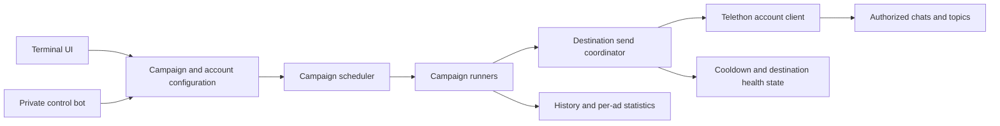

# Architecture

## Boundaries

- `source/app/core` owns campaigns, accounts, source resolution, destinations, topics, runners, and send coordination.
- `source/app/alerts` owns the Bot API control surface and inline menus.
- `source/app/utils` owns paths, JSON storage, settings, state, scheduling, locks, and safety checks.
- `source/app/analytics` and `source/app/database` own delivery history and operational statistics.
- `source/app/service_runtime.py` assembles the unattended runtime without duplicating campaign logic.
- `run.py` and `run_service.py` are thin entry points that add `source` to the import path.

## State

Code is read from the installation directory. Writable data is rooted at `APPDATA/TelegramForwarder`, keeping sessions and configuration separate from source. Campaign and destination JSON writes use replacement semantics; delivery history and account records use SQLite.

## Coordination

Each campaign has its own runner, but sends pass through a shared destination coordinator. The coordinator serializes work for the same destination, persists slow-mode deadlines, and distinguishes destination waits from confirmed account-wide FloodWaits.

## Recovery

Transient connection failures and Telegram waits are retried asynchronously. Persistent campaign state allows the service to resume after a restart. The example systemd unit adds process-level restart recovery while retaining Telegram-enforced waits.
